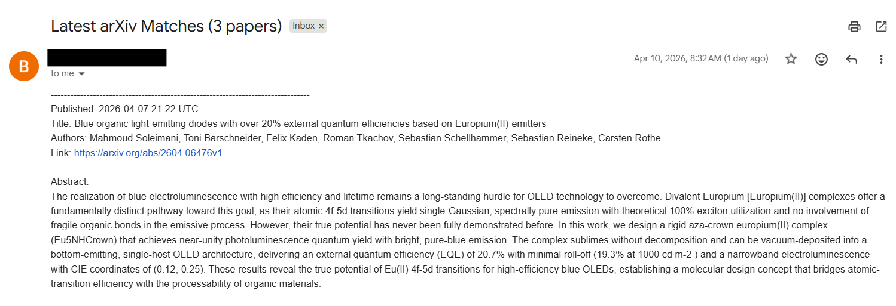

## What it does

- searches arXiv by title / abstract keywords
- sends one email digest with multiple papers
- runs automatically on a schedule via GitHub Actions

<p align="center">
  <br>
  <em>Figure 1. Final look.</em>
</p>

## How to use

### 1. Create your own repository from this template

Click **Use this template** on this repository, then create a new repository under your own account.

This will create your own copy of the project so you can customize the workflow schedule, email settings, and search configuration.

To change when the workflow runs, edit the `cron` expression in
[.github/workflows/arxiv-email-alert.yml](.github/workflows/arxiv-email-alert.yml).

Example (runs every day at 22:25 UTC):

```yaml
on:
  schedule:
    - cron: "25 22 * * *"  # minute hour day month weekday (UTC)
```

### 2. Add repository secrets

Go to:

`Settings -> Secrets and variables -> Actions -> Secrets`

Create these secrets:

- `SENDER_EMAIL`
- `RECEIVER_EMAIL`
- `GMAIL_APP_PASSWORD`

### 3. Add a repository variable

Go to:

`Settings -> Secrets and variables -> Actions -> Variables`

Create this variable:

- `CONFIG_YAML`

Example:

```yaml
query:
  include_keywords:
    - "gaussian"
    - "quantum"

  exclude_keywords: []

  categories: []

search:
  days_back: 7
  max_results: 10
```

### 4. Enable and test the workflow

Go to the **Actions** tab in your repository and run the workflow once manually to make sure everything is configured correctly.

Once the test run succeeds, GitHub Actions will continue to run automatically on the schedule you configured.

## How it works

<p align="center">
  <br>
  <em>Figure 2. Sequence diagram.</em>
</p>
