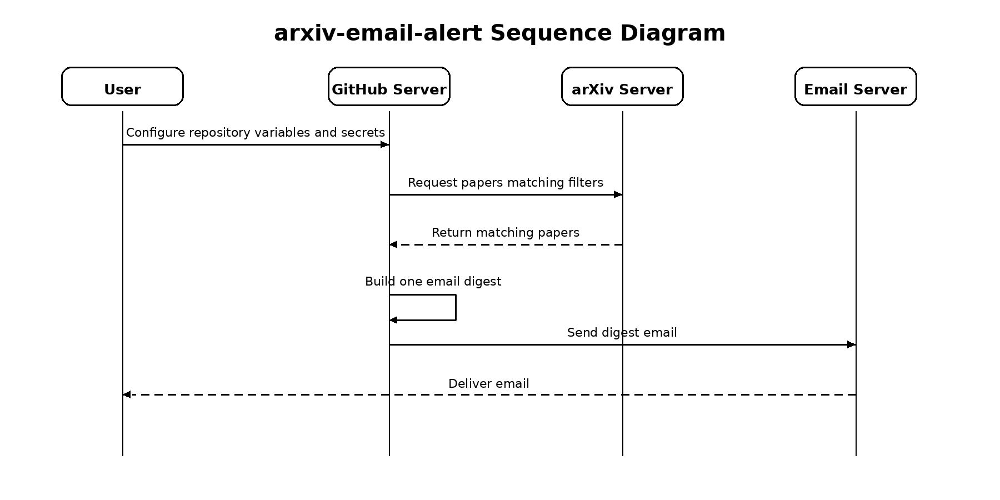

# arxiv-email-alert

Automated arXiv paper alerts with filtering and email notifications.

## What it does

- searches arXiv by:
  - title / abstract keywords
  - optional excluded keywords
  - optional categories
  - recent submission date range
- sorts results in reverse chronological order
- sends one email digest with multiple papers
- runs automatically with GitHub Actions

## How it works



## Project structure

```text
.
├── .github/
│   └── workflows/
│       └── arxiv-email-alert.yml
├── main.py
├── requirements.txt
├── README.md
└── .gitignore
```

## Configuration

This project does not store `config.yml` in the repository.

Instead, GitHub Actions creates `config.yml` at runtime from a repository variable named `CONFIG_YAML`.

Example config:

```yaml
query:
  include_keywords:
    - "large language models"
    - "reasoning"

  exclude_keywords: []

  categories: []

search:
  days_back: 7
  max_results: 10
```

## GitHub setup

### 1. Add repository variable

Go to:

`Settings -> Secrets and variables -> Actions -> Variables`

Create this variable:

- `CONFIG_YAML`

Paste your config YAML into the value field.

### 2. Add repository secrets

Go to:

`Settings -> Secrets and variables -> Actions -> Secrets`

Create these secrets:

- `SENDER_EMAIL`
- `RECEIVER_EMAIL`
- `GMAIL_APP_PASSWORD`

## License

MIT